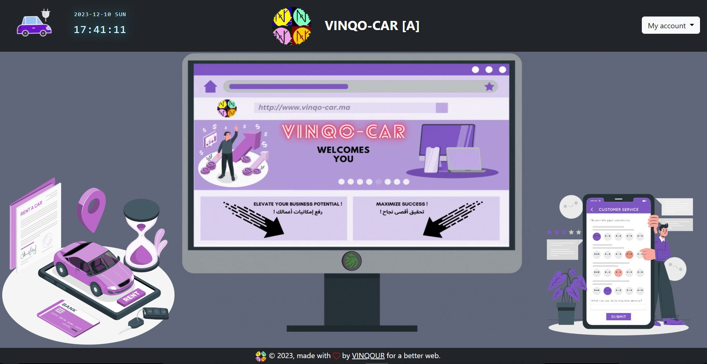
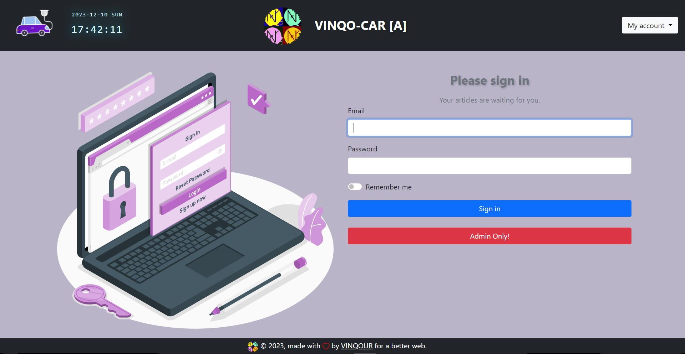
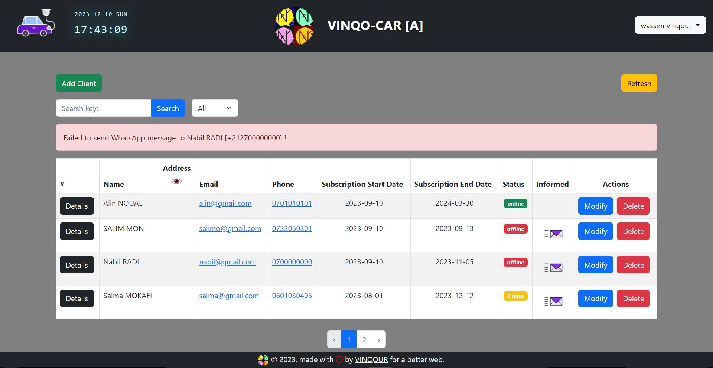
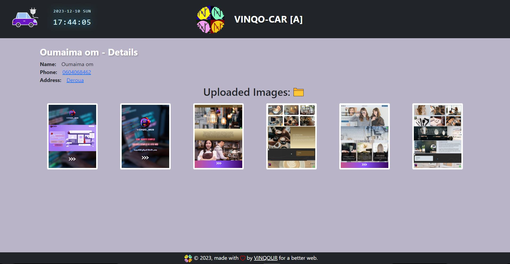
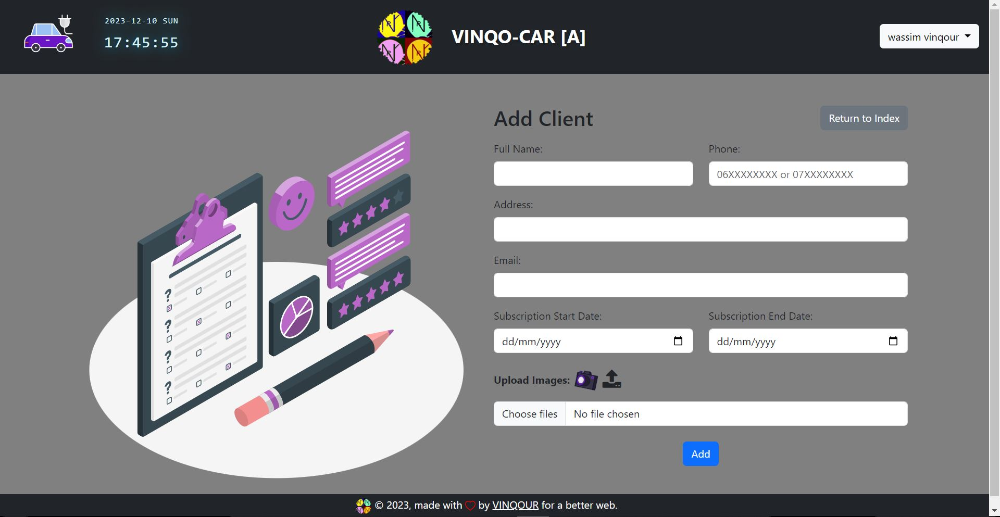
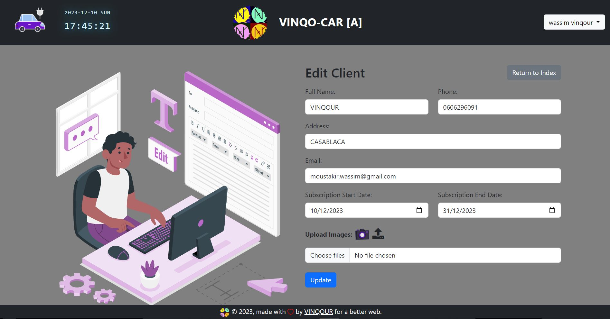
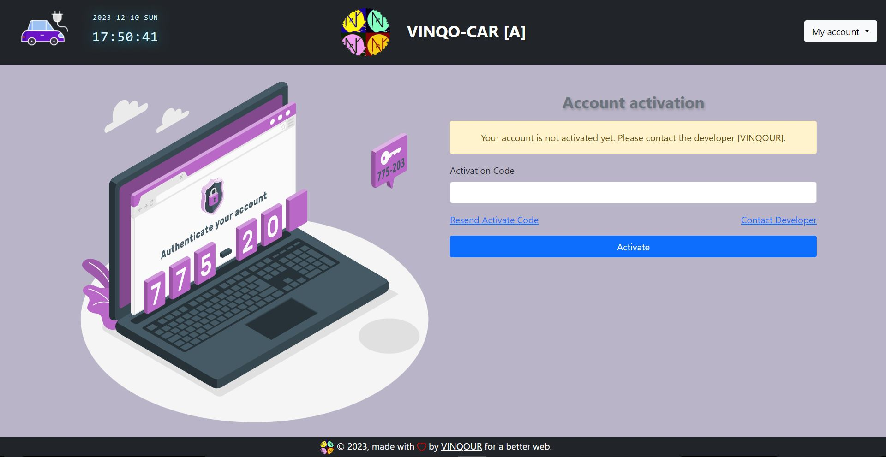

# VINQO-CAR

Welcome to my project! You can find the latest release and release notes in the [Releases](https://github.com/v1nqour/VINQO-CAR/releases) section.

## **Welcome Page:**

## **Sign In Page:**

## **Dashboard Page:**

## **Details Page:**

## **Add Client Page:**

## **Update Page:**

## **Account Activation Pages:**

### To set up a ***Laravel*** project using an alternative method, you can follow these steps:
####  type the following command in the Terminal:

#### If you encounter an error while setting up, try running this comand:
`composer update`  
#### Set the application key
`php artisan key:generate`
#### Migrate the database
`php artisan migrate`
#### Storage link
`php artisan storage:link`
#### serve the project
`php artisan serve`

### Open This link to display the project:
[Open](http://127.0.0.1:8000/)

## *BY MOUSTAKIR Wassim*

